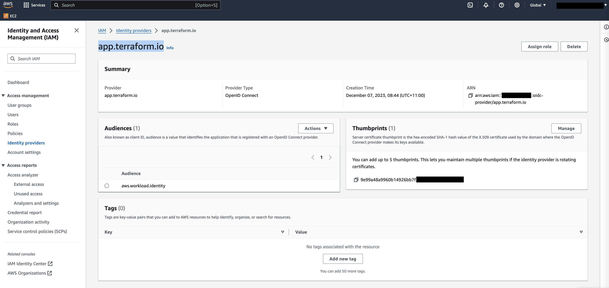
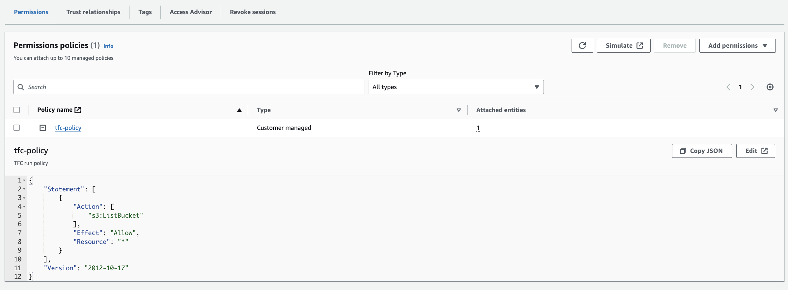
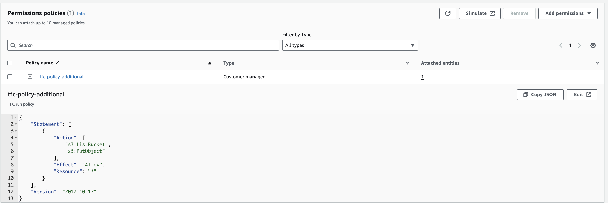
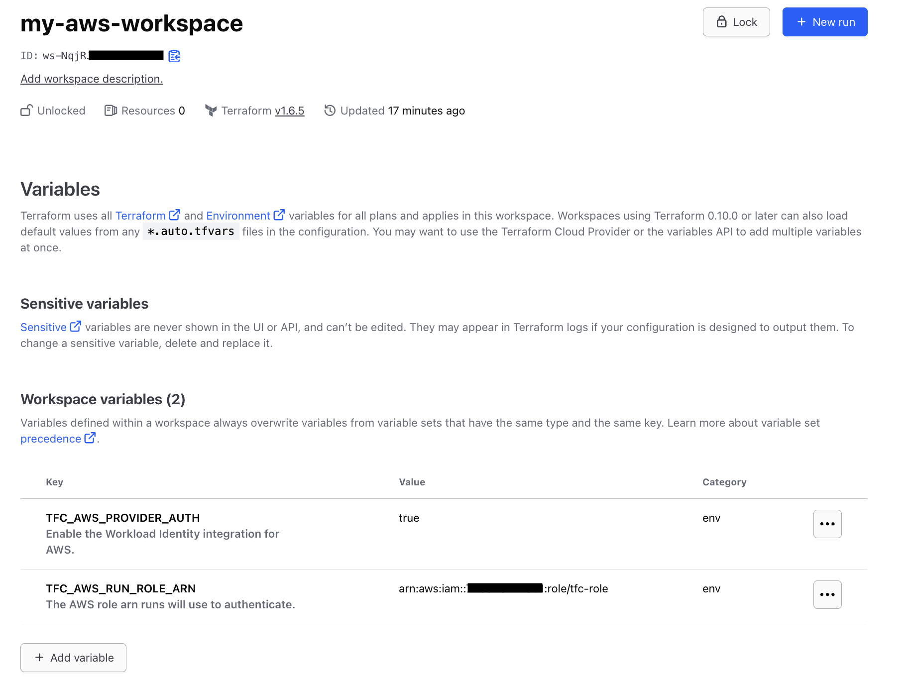
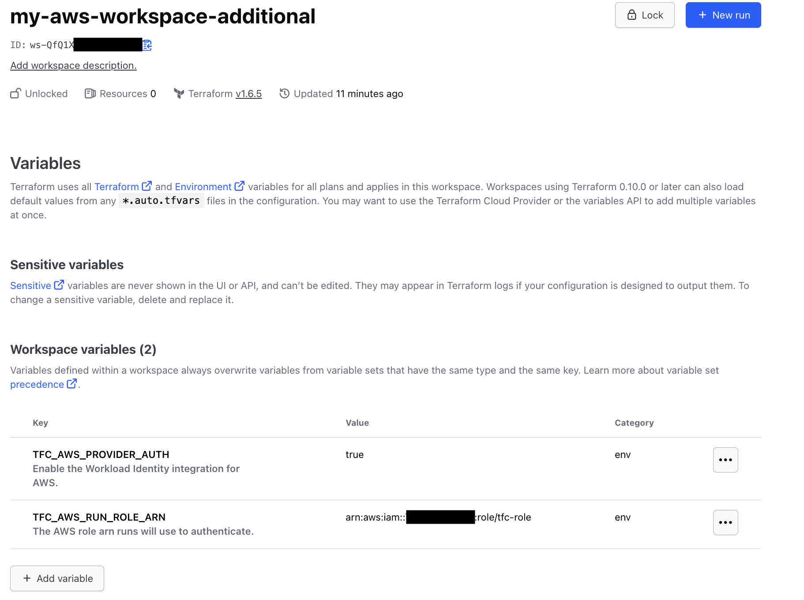

# Bootstrapping trust between a TFC workspace and AWS

This directory contains example code for setting up a Terraform Cloud workspace whose runs will be automatically authenticated to AWS using Workload Identity.

The basic building blocks in `aws.tf` will configure an OIDC provider in AWS and create a role that is bound to a particular Terraform Cloud workspace.

The building blocks in `tfc-workspace.tf` will create that Terraform Cloud workspace and set all the configuration variables needed in order to allow runs to authenticate to AWS.

## How to use

You'll need the Terraform CLI installed, and you'll need to set the following environment variables in your local shell:

1. `TFE_TOKEN`: a Terraform Cloud user token with permission to create workspaces within your organization.

You'll also need to authenticate the AWS provider as you would normally using one of the methods mentioned in the AWS provider documentation [here](https://registry.terraform.io/providers/hashicorp/aws/latest/docs#authentication-and-configuration).

Copy `terraform.tfvars.example` to `terraform.tfvars` and customize the required variables. You can also set values for any other variables you'd like to customize beyond the default.

Run `terraform plan` to verify your setup, and then run `terraform apply`.

Congratulations! You now have a Terraform Cloud workspace where runs will automatically authenticate to AWS when using the AWS Terraform provider.

# Multiple TFC workspaces/IAM roles interfacing with the same AWS account (and the same OIDC provider):

1. A single OIDC identity provider has been provisioned in our AWS account `app.terraform.io` : 
2. Multiple IAM roles have been provisioned in the AWS account `tfc-role` & `tfc-role-additional`, configured to leverage the same OIDC identity provider: 
3. Each role has it's own discrete policy with differing permissions attached   
4. Finally, we have created two TFC workspaces `my-aws-workspace` & `my-aws-workspace-additional` each configured to assume their own discrete role (`tfc-role` & `tfc-role-additional`):  